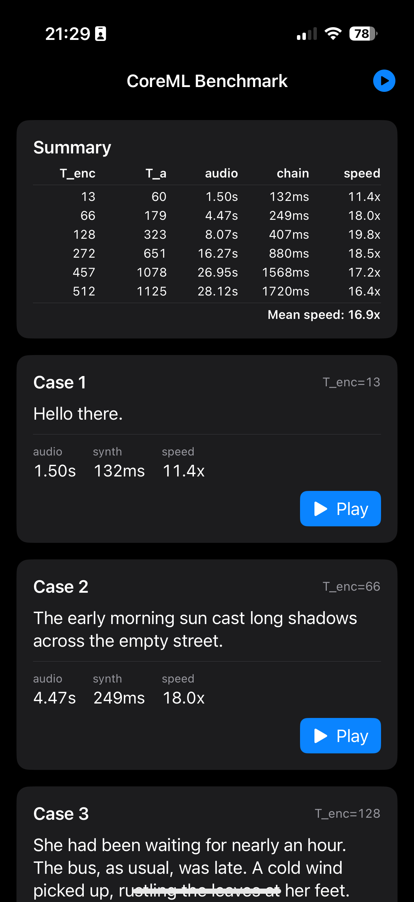

# kokoro-coreml

Convert Kokoro TTS to CoreML — fp16+int8pal preset, **25× real-time on M4 Mac Mini**, **17× on iPhone 16 Pro**, with the bulk of the workload running on ANE.

Produces 7 mlpackages: `KokoroAlbert`, `KokoroPostAlbert`, `KokoroAlignment`, `KokoroProsody`, `KokoroNoise`, `KokoroVocoder`, `KokoroTail`.

Planned for integration into my reader app, [ZRead](https://apps.apple.com/us/app/zread-epub-reader/id6758880626), for on-device TTS.

## Setup

[uv](https://github.com/astral-sh/uv), and `espeak-ng`.

```bash
brew install espeak-ng
uv sync
```

## Convert

```bash
uv run python convert.py
```

Outputs the 7 mlpackages plus `ref.wav` (PyTorch) and `test.wav` (CoreML chain) to `output/`. Flags: `--max-frames N` (default 2000, ≈50s of audio — covers ALBERT's 510-token cap with headroom), `--stages name1 name2 ...` (skipped stages reuse existing mlpackages).

## Benchmark

```bash
uv run python benchmark.py
```

Six real prose passages (T_enc 13 → 512). **25× real-time** on a max-length 510-phoneme paragraph (28s audio in ~1.1s, measured on M4 Mac Mini 24GB).

```
========================================================================
 T_enc   T_a  audio_s   chain_ms   speed  | per-stage ms
------------------------------------------------------------------------
    13    60     1.50       75.6   19.8x  | Alb=4  Pos=3  Ali=1  Pro=1  Noi=23  Voc=31  Tai=1
    66   178     4.45      172.3   25.8x  | Alb=11  Pos=14  Ali=1  Pro=3  Noi=46  Voc=82  Tai=3
   128   323     8.07      294.6   27.4x  | Alb=15  Pos=26  Ali=1  Pro=4  Noi=74  Voc=148  Tai=6
   272   651    16.27      642.6   25.3x  | Alb=37  Pos=54  Ali=2  Pro=8  Noi=141  Voc=344  Tai=8
   457  1078    26.95     1047.1   25.7x  | Alb=70  Pos=90  Ali=4  Pro=12  Noi=217  Voc=585  Tai=14
   512  1125    28.12     1101.1   25.5x  | Alb=74  Pos=103  Ali=4  Pro=13  Noi=228  Voc=635  Tai=13

Mean speed: 25.0x real-time  (higher is faster; >1.0x = real-time)
```

### iOS

Same chain runs on iPhone via `iOSDemo/`. Mean **16.9× real-time** on iPhone 16 Pro across the same six passages.



To run the demo, drop the 7 mlpackages from `output/` (after `convert.py`) into `iOSDemo/iOSDemo/Models/`. The `Resources/` folder ships the precomputed phonemes (`benchmark_data.json`), the `af_heart` voice (`af_heart.bin`, 510×256 fp32), and the phoneme `vocab.json` — regenerate with `uv run python dump_benchmark_data.py` if you edit the benchmark texts. G2P runs offline in Python so the app doesn't need espeak-ng.

## Stages and compute placement

| Stage | Precision | Compute Unit | Role |
|---|---|---|---|
| Albert | fp16 + int8pal | CPU_AND_NE | text encoder |
| PostAlbert | fp16 + int8pal | CPU_AND_NE | duration + d + t_en |
| Alignment | fp16 + int8pal | CPU_AND_NE | length regulation (cumsum + broadcast) |
| Prosody | fp16 + int8pal | ALL | F0 + N |
| Noise | fp32 + int8pal | ALL | SineGen + STFT + noise convs |
| Vocoder | fp16 + int8pal | CPU_AND_NE | dual output: anchor + x_pre |
| Tail | fp32 | ALL | conv_post + exp + sin + iSTFT |

## Design notes

This pipeline is the result of a long sequence of dead ends. Key lessons:

**Fight the ANE scheduler explicitly.** The scheduler is opaque — `compute_units=ALL` may silently spill ANE-eligible ops to GPU. **Force `CPU_AND_NE` first.** If the graph stays on ANE, ship it. If ops fall off ANE, adjust the graph (split the model, add anchor outputs, replace problematic op patterns) until they don't.

**Avoid GPU on iOS.** GPU work is suspended for backgrounded apps before iOS 26. The iOS 26+ entitlement [`com.apple.developer.background-tasks.continued-processing.gpu`](https://developer.apple.com/documentation/bundleresources/entitlements/com.apple.developer.background-tasks.continued-processing.gpu) (with `BGContinuedProcessingTask`) lifts this, but ANE-only stays simpler and works on older iOS.

**Standalone models, not one merged graph.** Primary reason: different stages need different compute units. We prefer fp16 everywhere — it's the precondition for ANE — but Noise and Tail lose audio quality in fp16 (sin/cumsum accumulate phase error past fp16's range), so they have to run fp32, which means off ANE. The rest stays fp16 on ANE. A merged graph picks one compute unit and the scheduler can't honor both. Splitting also sidesteps two CoreML quirks: `FP16ComputePrecision(op_selector=...)` is broken (skips `cast_to_fp16` on selected ops but doesn't insert `cast_to_fp32` at boundaries, so "fp32" ops run fp16 anyway), and `make_pipeline()` locks shapes.

**Noise stage is fp32 + separated.** SineGen does `cumsum(F0/SR) * 2π * 300 → sin()`; in fp16 the accumulated phase is huge and `sin()` collapses (corr 0.94 → 0.82). Splitting it out also dodges a scheduler blocker: two `RangeDim` streams merging in one model causes 141+ GPU ops (6× slowdown).

**Vocoder dual-output trick** — the canonical scheduler fight. ANE accumulates in pure fp16 (unlike GPU/PyTorch with fp32 accumulators), so 36 chained Conv+Snake passes amplify error through `exp()` in iSTFT → hoarseness. Mixed precision, phase reduction, fp16 fine-tuning, cos substitution all fail. Splitting the model to do the iSTFT tail off-ANE in fp32 also fails on its own — the truncated body's `[1, 128, T]` output makes the scheduler bail (168/617 ops to CPU, 353ms vs 44ms). **Working solution**: keep the full vocoder graph, add `x_pre` as a *second output*, discard the original `audio` output. The discarded output is a graph anchor that keeps the scheduler committed to ANE. A separate fp32 `Tail` mlpackage runs `conv_post + exp + sin + iSTFT` on CPU/GPU (~2ms) for clean audio.

**Cos Snake.** `sin²(αx) = (1 − cos(2αx))/2`. Slightly faster on ANE; quality identical.

**Int8 palettization on vocoder is safe here** because its audio output is discarded — palette artifacts never reach the listener. The fp32 Tail (which produces audio) is unpalettized.

**Distillation was a detour that surfaced the noise-stream insight.** We suspected the vocoder's `ConvTranspose1d` upsamples were the ANE blocker, so we distilled into a generator with `nearest-neighbor upsample + Conv1d` in place of `ConvTranspose1d`. The distilled student compiled, but most ops still wouldn't schedule onto ANE; bisecting why led to the dual-`RangeDim` scheduler blocker — splitting the noise generator into its own mlpackage fixed it. Quality issues in the student were closed separately by better training (improved losses, layer-tuning pretrain, then MPD adversarial training). Once the noise split was understood, the same split applied to the original (undistilled) vocoder, so distillation was dropped from the shipping pipeline.
